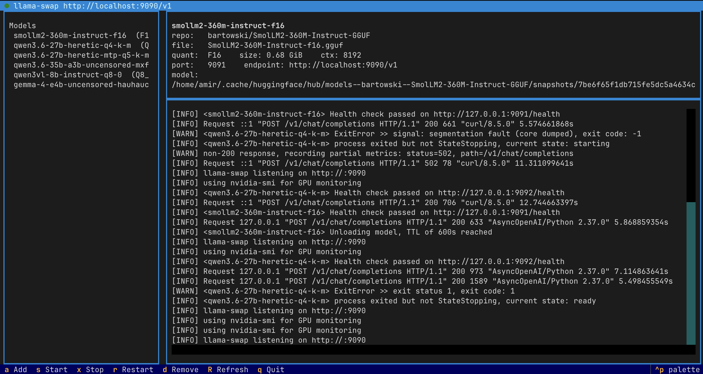

# Run any Hugging Face model on your own GPU

**Two commands. Zero config. No YAML. No CLI flags to memorise.**

```bash
pip install inferhost
inferhost
```

That's it. `inferhost` opens a friendly terminal UI. The first launch downloads `llama.cpp` and `llama-swap` for you with a progress bar. Then you press **`a`**, paste a Hugging Face repo id, and you have an OpenAI-compatible endpoint running on `http://localhost:9090/v1`.

{: style="max-width:100%;border:1px solid #ddd;border-radius:6px;margin:1em 0;"}

[Install inferhost »](installation.md){: .btn .btn-primary}
[Show me how it works »](usage.md){: .btn}
[GitHub](https://github.com/amirrouh/inferhost){: .btn}

---

## What you get

- **One command.** No subcommands, no flags, no YAML. Just `inferhost`.
- **TUI for everything.** Add a model, rename its alias, set a per-model context
  window, change ports, toggle the gateway, watch every daemon's status — all in
  one place, all from the keyboard. You never have to touch a YAML file.
- **Smart quant pick.** inferhost reads your GPU's VRAM and chooses the highest-quality GGUF quant that will fit.
- **OpenAI-compatible API.** Drop-in for the OpenAI SDK and anything that speaks OpenAI (Continue, LibreChat, etc.). Tool calling and vision work out of the box.
- **Vision built in.** When a repo ships an `mmproj-*.gguf`, inferhost auto-downloads it and wires `-mm` so OpenAI-style image inputs Just Work.
- **Stacked speculative decoding.** MTP-capable models get `--spec-type draft-mtp` and `--spec-type ngram-mod` stacked automatically.
- **Auto-detected hardware.** NVIDIA via CUDA / Vulkan, AMD via ROCm, Intel via SYCL / OpenVINO, Apple Silicon via Metal, or CPU fallback.
- **Progress everywhere.** Binary downloads, model downloads — every long step shows live progress.

## The 60-second tour

### 1. Install

```bash
pip install inferhost
```

(Python 3.11+ on Linux or macOS.)

### 2. Launch

```bash
inferhost
```

On the very first run you'll see a small progress screen while the runtime binaries download. After that, you land on the dashboard.

### 3. Add a model

Press **`a`**. Type a Hugging Face repo id, e.g.:

```
Qwen/Qwen2.5-7B-Instruct-GGUF
```

Press **Enter**. inferhost lists all available GGUF files in the repo, highlights the one that best fits your GPU with a ⭐, and shows a live progress bar while it downloads.

### 4. Use it

The dashboard shows the OpenAI-compatible endpoint at the top. Point anything at it:

```bash
curl http://localhost:9090/v1/chat/completions \
  -H "Content-Type: application/json" \
  -d '{
    "model": "qwen2.5-7b-instruct-q4-k-m",
    "messages": [{"role": "user", "content": "Hello!"}]
  }'
```

Or with the OpenAI Python SDK:

```python
from openai import OpenAI

client = OpenAI(base_url="http://localhost:9090/v1", api_key="none")
resp = client.chat.completions.create(
    model="qwen2.5-7b-instruct-q4-k-m",
    messages=[{"role": "user", "content": "Hello!"}],
)
print(resp.choices[0].message.content)
```

## Keys in the TUI

| Key | What it does |
|---|---|
| **`a`** | **A**dd a Hugging Face model (downloads the GGUF + any `mmproj-*.gguf`) |
| **`n`** | Re**n**ame the highlighted model's alias — also rewrites llama-swap + LiteLLM configs |
| **`c`** | **C**onfigure the highlighted model — per-model context window and KV cache quant |
| **`d`** or **`Delete`** | Remove the highlighted model |
| **`s`** | **S**tart llama-swap |
| **`x`** | Stop llama-swap |
| **`r`** | **R**estart llama-swap |
| **`g`** | Toggle the LiteLLM **g**ateway on/off |
| **`p`** | Open the **P**references panel (change ports, context, GPU layers, ...) |
| **`R`** | Refresh the view |
| **`q`** | **Q**uit |

## Architecture in one diagram

```
   Your app  ──HTTP──▶  llama-swap  ──spawns──▶  llama-server (llama.cpp)
                       (port 9090)              (GGUF inference)
                            ▲
                            │
                  (optional) LiteLLM gateway
                            │
                       (port 9001)
```

- **llama.cpp** does the actual inference, using whichever prebuilt backend matches your GPU.
- **llama-swap** sits in front of multiple llama.cpp instances and lazy-loads them on the first request, then unloads after idle.
- **LiteLLM** (optional) adds aliases, routing, and rate-limiting across many providers.

## Where to next?

- [Installation](installation.md) — pip, uv tool, gateway extra, system requirements
- [Usage](usage.md) — adding models, OpenAI clients, integrations
- [Configuration](configuration.md) — every environment variable explained
- [Troubleshooting](troubleshooting.md) — common errors and how to fix them
- [Source on GitHub](https://github.com/amirrouh/inferhost)
- [Package on PyPI](https://pypi.org/project/inferhost/)
